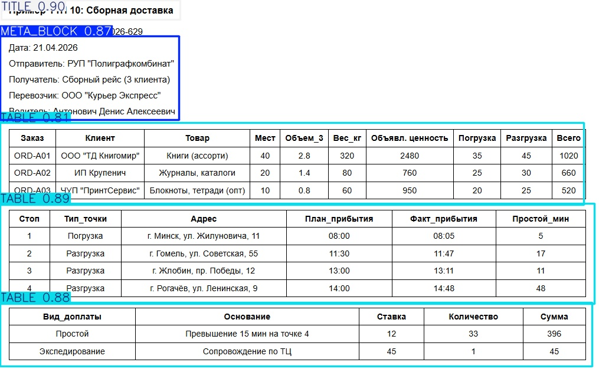
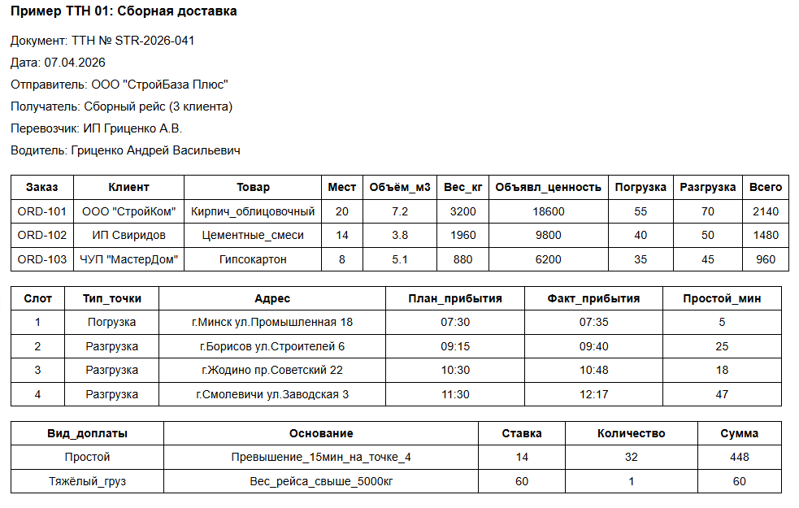
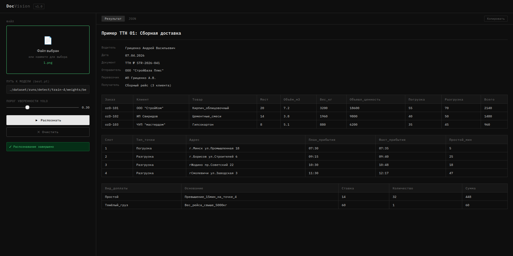

# DocVision

> Система автоматического распознавания товарно-транспортных накладных (ТТН) на основе компьютерного зрения и OCR.

---

## О проекте

**DocVision** — это локальный веб-инструмент для интеллектуального разбора сканов и фотографий ТТН (товарно-транспортных накладных). Система автоматически определяет структурные блоки документа, извлекает текст и возвращает структурированный JSON с заголовком, мета-данными и таблицами.

Проект решает задачу, с которой сталкиваются логисты и операторы документооборота: ручной перенос данных из бумажных накладных в информационные системы — трудоёмкий и ошибочный процесс. DocVision автоматизирует этот шаг.

---

## Как это работает

Обработка документа проходит через три последовательных этапа:

```
Изображение ТТН
      │
      ▼
[1] YOLO-детектор
      Находит зоны: TITLE / META_BLOCK / TABLE
      │
      ▼
[2] Tesseract OCR
      Распознаёт текст в каждой зоне (rus+eng)
      │
      ▼
[3] Структурный парсер
      Собирает JSON: title, meta, tables[]
      │
      ▼
Веб-интерфейс / JSON-ответ
```

### Модули

| Файл | Роль |
|---|---|
| `app.py` | Flask-сервер, REST API `/api/process` |
| `detector.py` | YOLO-детектор зон документа |
| `ocr_engine.py` | Обёртка над Tesseract, возвращает слова с bbox |
| `parser.py` | Разбор мета-блоков и таблиц из OCR-слов |
| `printer.py` | Консольный вывод результата в табличном виде |
| `ttn_pipeline.py` | Оркестратор: объединяет все этапы |

---

## Обучение YOLO

Для детекции зон использована модель **YOLOv8** от Ultralytics, дообученная на размеченных изображениях ТТН.

### Классы объектов

| ID | Класс | Описание |
|---|---|---|
| 0 | `TITLE` | Заголовок документа |
| 1 | `META_BLOCK` | Блок реквизитов (дата, отправитель, водитель и т.д.) |
| 2 | `TABLE` | Таблица с данными о грузах, маршруте или доплатах |

### Процесс обучения

1. Собрана выборка изображений ТТН различного качества (сканы и фото).
2. Произведена разметка в формате YOLO (bounding boxes) с помощью [Label Studio](https://labelstud.io/).
3. Базовая модель: `yolov8n.pt` (nano) — баланс скорости и точности.

### Результат детекции

На изображении ниже видно, как YOLO выделяет зоны документа с указанием класса и уверенности:



> `TITLE 0.90` — заголовок, `META_BLOCK 0.87` — блок реквизитов, `TABLE 0.81 / 0.89 / 0.88` — три таблицы документа.

---

## Результаты работы системы

### Исходный документ (ТТН)



### Веб-интерфейс с распознанными данными



Система корректно извлекла:
- Заголовок и все реквизиты (водитель, дата, документ, отправитель, перевозчик, получатель)
- Три таблицы: список грузов, маршрутные точки, доплаты

---

## Демонстрация

▶️ **Видео-демонстрация работы:** [https://youtu.be/9iNAL2LjUE0](https://youtu.be/9iNAL2LjUE0)

---

## Установка и запуск

### Требования

- Python 3.9+
- Tesseract OCR с языковым пакетом `rus`

```bash
# Ubuntu / Debian
sudo apt install tesseract-ocr tesseract-ocr-rus

# macOS (Homebrew)
brew install tesseract tesseract-lang
```

### Клонирование репозитория

```bash
git clone https://github.com/zen256/DocVision.git
cd DocVision
```

### Установка зависимостей

```bash
pip install -r src/requirements.txt
```

### Запуск веб-сервера

```bash
cd src
python app.py
```

Откройте браузер: [http://localhost:5000](http://localhost:5000)

### Запуск из командной строки (без веб-интерфейса)

```bash
cd src
python ttn_pipeline.py path/to/ttn_image.jpg \
  --model ../models/yolo_ttn_model.pt \
  --output result.json \
  --conf 0.3
```

---

## Структура проекта

```
DocVision/
├── src/
│   ├── app.py              # Flask веб-сервер
│   ├── ttn_pipeline.py     # Главный пайплайн
│   ├── detector.py         # YOLO-детектор
│   ├── ocr_engine.py       # Tesseract OCR
│   ├── parser.py           # Структурный парсер
│   ├── printer.py          # Консольный вывод
│   └── requirements.txt    # Зависимости Python
├── models/
│   └── yolo_ttn_model.pt   # Веса YOLO
├── img/
│   └──ttns.png             # Примеры входного документа
└── README.md
```

---

## Технологический стек

- **[YOLOv8 (Ultralytics)](https://github.com/ultralytics/ultralytics)** — детекция зон документа
- **[Tesseract OCR](https://github.com/tesseract-ocr/tesseract)** — распознавание текста (rus+eng, LSTM)
- **[OpenCV](https://opencv.org/)** — предобработка изображений
- **[Flask](https://flask.palletsprojects.com/)** — REST API и веб-интерфейс
- **Python 3.9+**

---

